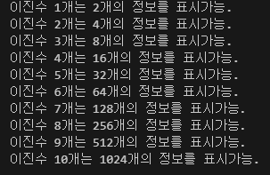

# 박재한 JavaScript 연습문제 과제
>2024.8.19

# 문제1

```javascript
const 수학 = "A";

if (수학 == "A"||수학 == "B"||수학 == "C"){
    console.log("이 과목을 Pass했습니다.")
}

else {
    console.log("이 과목을 Pass하지 못했습니다.")
}

 ```


 # 문제2

 ```javascript
 let x = 1;
let i = 0;

while (i <10){
    x = x*2;
    console.log("이진수 %d개는 %d개의 정보를 표시가능. ",i+1,x);
    i++;
}
```


# 문제3

```javascript
for(let x=1,i=0;i<10;i++){
    x = x*2;
    console.log("이진수 %d개는 %d개의 정보를 표시가능. ",i+1,x);
}
```

