# 박재한 JavaScript 연습문제 과제
>2024.8.21

# 문제1
```javascript
const check_list = [true,false,false,true,false];
console.log("before-->"+ check_list);
for(let i =0; i<check_list.length;i++){
    // if(check_list[i]===true){
    //     check_list[i]=false;
    // }
    // else{check_list[i]=true;}
    check_list[i] =!check_list[i];
}
console.log("after-->"+check_list);
```
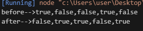


# 문제2
```javascript
let grade = [75, 82, 91];
let sum=0;
let avg=0;
for(let i=0;i<grade.length;i++){
    sum+=grade[i];
}
avg=sum/grade.length;

console.log("총점: %d ",sum);
console.log("평균: %d",avg)

```
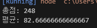

# 문제3
```javascript
let arr = [7,5,5,5,5,10,7];
let sum = 0;
for(let i=0; i<arr.length ;i++){
    if(i>3){
        sum+=arr[i]*5200;
    }
    else{
        sum+=arr[i]*4500;
    }
}

console.log("일주일간의 총 급여 : %d원",sum);
```
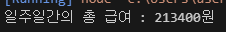

# 문제4
```javascript
let price = [38000,20000,17900,17900];
let qty = [6,4,3,5];
let money = 0;

for(let i = 0; i<price.length;i++){
    money+=price[i]*qty[i];
}
console.log("총 결제 금액: %d원",money);
```
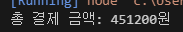

# 문제5
```javascript
let price = [38000,20000,17900,17900];
let qty = [6,4,3,5];
let arr = new Array(4);

for(let i = 0; i<price.length;i++){
    let money=price[i]*qty[i];
    arr[i]=money; 
}
let max = arr[0];
for(let j =0; j<arr.length;j++){
    if(max<arr[j]){
        max=arr[j];
    }
}
console.log("상품금액이 가장 비싼 항목의 금액: %d",max);
```
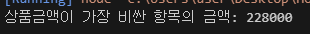

# 문제6
```javascript
let price = [38000,20000,17900,17900];
let qty = [6,4,3,5];
let arr = new Array(4);
let count=0;

for(let i = 0; i<price.length;i++){
    let money=price[i]*qty[i];
    arr[i]=money; 
}
for(let j =0; j<arr.length;j++){
    if(arr[j]>=80000){
        count++;
    }
}
console.log("무료로 배송되는 상품: %d",count);
```
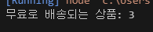

# 문제7
```javascript
let money = [209000,109000,119000,109000,94000];

for(let i=0;i<money.length;i++){
    for(let j=0;j<money.length-1-i;j++){
        if(money[i]<money[j]){
            const tmp = money[i];
            money[i]=money[j];
            money[j]=tmp;
        }
    }
}
console.log(money);
```
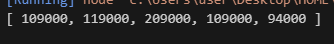

# 문제8
```javascript
const arr=[5,3,2,8,9];

const p = arr.length %2 ==0 ? arr.length /2 : (arr.length-1) /2;

for(let i =0; i<p ; i++){
    
    const k =arr.length -i - 1; // 반대쪽 원소의 위치
    
    const tmp =arr[i];
    arr[i]=arr[k];
    arr[k]=tmp;
}

console.log(arr);
```
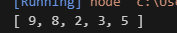

# 문제9
```javascript
let student = ["둘리","도우너","또치","희동"];
let grade = [[78,89,96],[62,77,67],[54,90,80],[100,99,98]]
let avg=0;
let sumarr = new Array();
let avgarr = new Array();
for(let k =0;k<student.length;k++){
    for(let i=0;i<grade.length;i++){
        let sum=0;
        let avg=0;
        for(let j=0;j<grade[i].length;j++){
            sum+=grade[i][j];    
        }
        avg=sum/grade[i].length;
        sumarr[i]=sum;
        avgarr[i]=avg;
    }
    console.log("%s 총점 : %d점 , 평균 : %d점",student[k],sumarr[k],avgarr[k]);
}

```
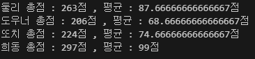

# 문제10
```javascript
let student = ["둘리","도우너","또치","희동"];
let grade = [[78,89,96],[62,77,67],[54,90,80],[100,99,98]]
let avg=0;
let sumarr = new Array();
let avgarr = new Array();
let avgsum =0;

for(let k =0;k<student.length;k++){
    for(let i=0;i<grade.length;i++){
        let sum=0;
        let avg=0;
        for(let j=0;j<grade[i].length;j++){
            sum+=grade[i][j];    
        }
        avg=sum/grade[i].length;
        sumarr[i]=sum;
        avgarr[i]=avg;
    }
    avgsum += avgarr[k];
}

console.log("반 평균: %d점",avgsum/student.length);
```
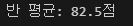

# 문제11
```javascript
let gold = [[500,291],[320,586],[100,460],[120,558],[92,18],[30,72]];

let sum = 0;

for(let i=0;i<gold.length;i++){
    sum+=(gold[i][0]/100*90)*(gold[i][1]);
}

console.log("골드(G)의 총액 : %d G",sum);
```
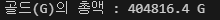

# 문제12
```javascript
let names = ["재석","민영","종민","광수","승기","세정"];
let points = [82,91,54,62,88,90];

let arr = [names,points];

for(let i =0; i<arr[1].length-1;i++){
    for(j=0; j<arr[1].length-1-i;j++){
        if(arr[1][j]<arr[1][j+1]){
            const tmp = arr[1][j];
            arr[1][j]=arr[1][j+1];
            arr[1][j+1]=tmp;

            const tmp2 = arr[0][j];
            arr[0][j]=arr[0][j+1];
            arr[0][j+1]=tmp2;
        }
    }
}
console.log(arr[0]);
```
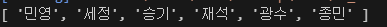

# 문제13
```javascript
let arr =new Array(5)
for(let k=0;k<arr.length;k++){
    arr[k] =new Array(5);
}


for(let i=0;i<arr.length;i++){
    for(let j=0;j<arr[i].length;j++){
        if(i==j){
            arr[i][j]=1;
        }
        else{
            arr[i][j]=0;
        }
    }
}
console.log(arr)
```
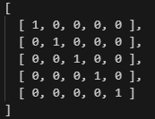

# 문제14
```javascript
let arr=[[1,5,7,'J','Q','A'],[2,3,4,5,'Q','K','A']];
let count =0;

let arr2= new Array();
let arr3= new Array();
let p=0;
for(let i=0;i<arr[1].length;i++){
    for(let j =0;j<arr[0].length;j++){
        if(arr[1][i]===arr[0][j]){
            count++;
            
            arr2[p]=j;
            arr3[p]=arr[0][j];
            p++;
        }
    }

}

console.log("가져올 수 있는 카드의 수: %d 장",count);

for(let k=0;k<arr2.length;k++){
    console.log("%s번째 >> %s",arr2[k],arr3[k]);
}
```
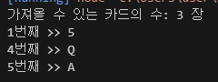
